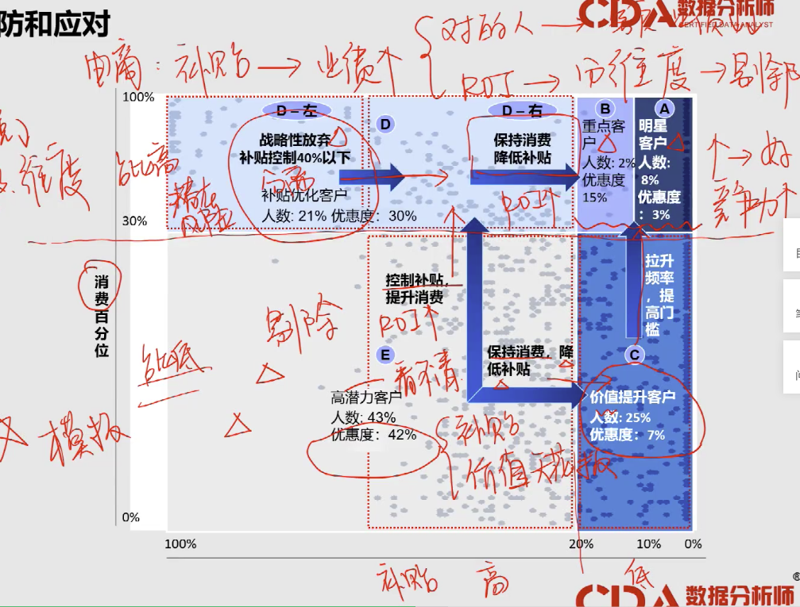
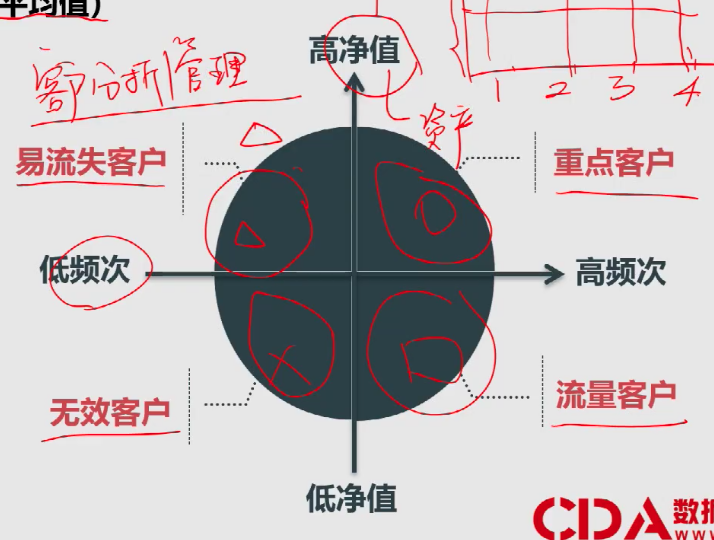

TO READ:

(1) 《指导生活的算法》 算法之美

(2) 金字塔原理

1. 结绳计数 - 统计学 - 现代统计学

   信息记录 - 信息的归纳 - 信息的应用

   主要是：__应用__

2. 《指导生活的算法》 算法之美

3. 分析 vs 挖掘   

分析：给予过程；同样的输入样本，结论不同

数据分析是指用适当的统计分析方法对收集来的大量数据进行分析，未提取有用信息和形成结论而对数据加以详细研究和概括总结的过程。

挖掘：就与输入；同样的模型，效果不同

数据挖掘(Data Mining)就是从大量的数据中，提取隐藏在其中的，事先不知道的、但潜在有用的信息的过程。数据挖掘的目标是建立一个决策模型，根据过去的行动数据来预测未来的行为，是一门交叉学科，它涉及了数据库，人工智能，统计学，可视化等不同的学科和领域。

两者区别：

1.从侧重点上来说，相比较而言，数据分析更多依赖于业务知识，数据挖掘更多侧重于技术的实现，对于业务的要求稍微有所降低。

2.从数据量上来说，数据挖掘往往需要更大数据量，而数据量越大，对于技术的要求也就越高。

3.从技术上来说，数据挖掘对于技术的要求更高，需要比较强的编程能力，数学能力和机器学习的能力。

4.从结果上来说，数据分析更多侧重的是结果的呈现，需要结合业务知识来进行解读。而数据挖掘的结果是一个模型，通过这个模型来分析整个数据的规律，一次来实现对于未来的预测，比如判断用户的特点，用户适合什么样的营销活动。显然，数据挖掘比数据分析要更深一个层次。

4. 数据

- 收集：1. 自身积累 2. 外部交换、购买 数据交易中心 3. 爬虫

     4. 开放数据集
- 处理：1. 架构 -- 软性、硬件
- 应用：1. 分析：思路方法 -- 价值 2. 挖掘：模型 -- 核心信息，未知结论

5. 商业智能：数据分析/挖掘 x 数据理解

5.1 经验 -> 数据 -> 知识    （-->经验）

5.2 价值：避免主观谬误、提高判断效率、易推广，易迭代

5.3 结论简明化，结论化（数据分析的本质，不在乎分析的工具多么的炫酷），通用化（广义-方法、流程）

5.4 常用流程：

数据准备：问题的理解

需求评论：分析 -> 结论

数据展示：可视化

5.5 常见商业场景：战略（总结和创新）

核心爆点：一个就够；同样也是很多明星有人设，目的都是为了让自己的有特点

例如：vivo的广告词：逆光也清晰，照亮你的美

是通过总结客户群体：年龄、喜好、关注

诚品书店：（竞对分析：产品线，选址，书籍分布）

总结：有舍才有得：全 != 好

5.6 理解客户：

营销活动：

6. 数据分析思维

6.1 数据分析的本质

发现和解决问题：现实与期望的落差

6.2 数据分析的目的

（1）解决问题：找到真正的原因

紧急处理：解决表面问题 -- 止损

避免复发：找到深层原因 -- 基于事实，使用数据，分解结构

明确因果关系

（金融：低频，高客单价）

（2） 防范风险：预防和应对

确定潜在风险

影响因素：需要知道常用的情景

可承受损失范围

策略制定

例子：电商补贴

模型：

（3）追求理想：合理的理想

明确理想

评估是否值得

规划性思考

行动计划 -- 定性 -- 战略分析

6.3 通用分析思路设计

业务增长模型

（1）追求理想：提高客单价或者购买频次

（2）防范风险：保持市场份额占比

（3）解决问题：客户流失

6.4 总结 -- 四个层次

战略规划：内外部数据结合，长期规划的过程。注重方向判断，弱化细节预测

策略分解：根据战略和目标，拆解为可以执行的层面。注重KPI设定

市场营销：活动和获客驱动。注重成本核算、效果预测和时候评估

业务运营：关注日常数据。注重监控预警和分析发现

7. 数据分析常用方法

7. 1 结构化的分析方法

事实+前提+逻辑 = 观点

7.2 事实的提炼：现实的抽象化

1）收集型数据：正常业务自然产生的数据

区分定性部分和定量部分 -> 定性部分分情况展示（维度）  -> 定量部分寻找具体数据（数值）

2）创造性数据：事先设计的实验产生的数据 -- 整理和归纳 

设计要合理：要选择合适的方案；选择合适的群体

例子：

7.3 逻辑的推进

逻辑顺序展现了组织思想的分析过程

推荐：《金字塔原理》

7.4 矩阵分析：陌生问题的分析路径

(1) 构建坐标系：两个变量（因素）

(2) 选择原点：离散（高/低）-- 标签，连续（中位数/平均值）-- 数值

(3) 四象限：问题的解剖

(4) 制定策略：依象限而定 -- 情景->结论

例子：客户分析管理

