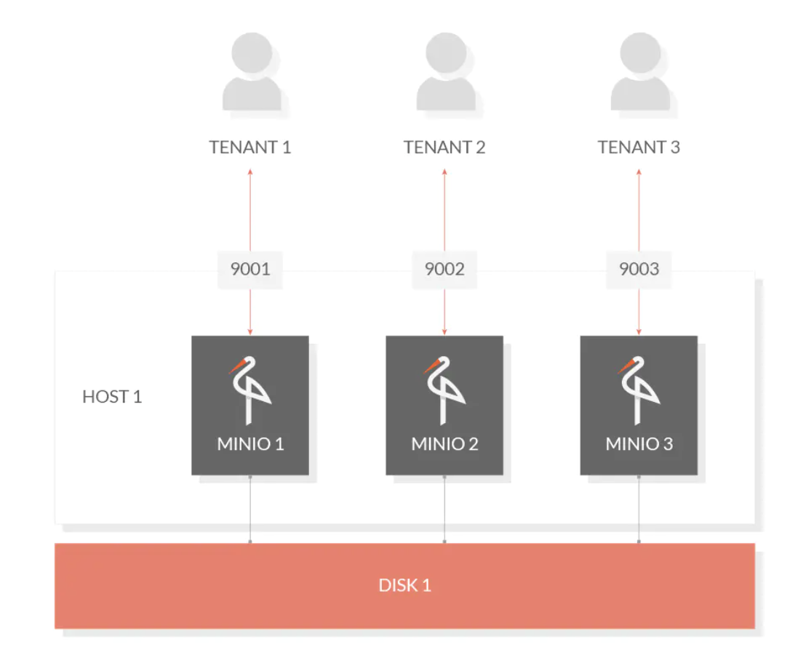
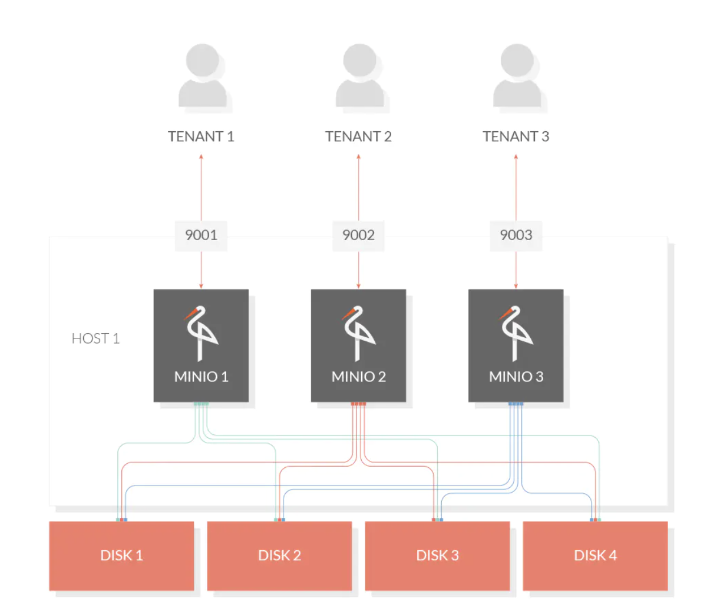
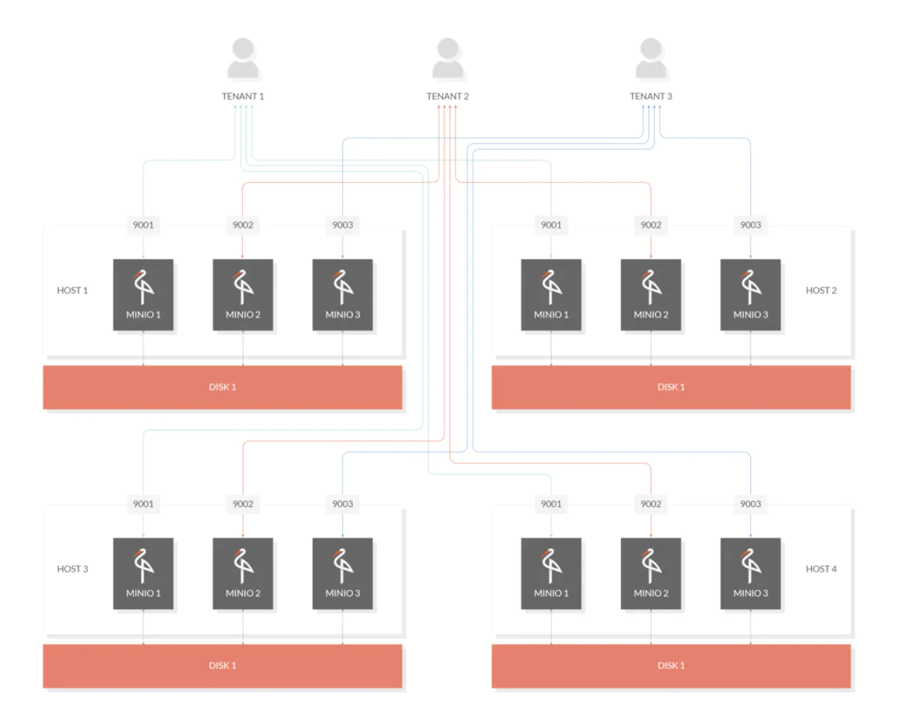

1. Minio 是一个基于Apache License v2.0开源协议的对象存储服务。

   非常适合于存储大容量非结构化的数据，例如图片、视频、日志文件、备份数据和容器/虚拟机镜像等，而一个对象文件可以是任意大小，从几kb到最大5T不等。
    Minio是一个非常轻量的服务,可以很简单的和其他应用的结合，类似 NodeJS, Redis 或者 MySQL。

2. 单主机单硬盘模式：

单主机多硬盘模式：

多主机多硬盘分布式

3. 特点

   * 高性能
   * 可扩容
   * 云原生
   * Amazon S3兼容
   * 可对接后端储存：除了Minio自己的文件系统，还支持DAS、JBODs、NAS、Google云存储和Azure Blob存储
   * SDK支持：基于Minio轻量的特点，它得到类似Java、Python或Go等语言的sdk支持
   * Lambda计算：Minio服务器通过兼容AWS SNS/SQS的事件通知服务触发Lambda功能。目前支持的目标队列，如Kafka，NATS，AMQP，MQTT，Webhooks以及ES，Redis，Postgres和MySQL等数据库
   * 有操作页面
   * 功能简单：MinIO不容易出错，更快启动
   * 支持纠错码

4. 存储机制

   MinIO使用纠错码erasure code和校验checksum。即便丢失一半数量(N/2)的硬盘，仍然可以恢复数据

