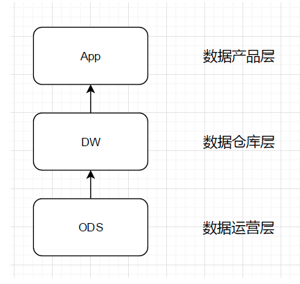

数据分层：

1. ODS：

operational data store 操作数据存储

“面向主题的”，数据运营层，也叫ODS层，是最接近数据源中数据的一层，数据源中的数据，经过抽取、洗净、传输，也就说传说中的ETL之后，装入本层。本层的数据，总体上大多是按照源头业务系统的分类方式而分类的。

鲜明的业务数据库特征

但是，这一层面的数据却不等同于原始数据。在源数据装入这一层时，要进行诸如去噪（例如去掉明显偏离正常水平的银行刷卡信息）、去重（例如银行账户信息、公安局人口信息中均含有人的姓名，但是只保留一份即可）、提脏（例如有的人的银行卡被盗刷，在十分钟内同时有两笔分别在中国和日本的刷卡信息，这便是脏数据）、业务提取、单位统一、砍字段（例如用于支撑前端系统工作，但是在数据挖掘中不需要的字段）、业务判别等多项工作。

2. DW：

data warehouse 数据仓库主体

在这里，从ODS层中获得的数据按照主题建立各种数据模型。例如以研究人的旅游消费为主题的数据集中，便可以结合航空公司的登机出行信息，以及银联系统的刷卡记录，进行结合分析，产生数据集。在这里，我们需要了解四个概念：维（dimension）、事实（Fact）、指标（Index）和粒度（ Granularity）。

3. APP 

数据产品层

**这一层是提供为数据产品使用的结果数据**

在这里，主要是提供给数据产品和数据分析使用的数据，一般会存放在es、mysql等系统中供线上系统使用，也可能会存在Hive或者Druid中供数据分析和数据挖掘使用。
比如我们经常说的报表数据，或者说那种大宽表，一般就放在这里。

